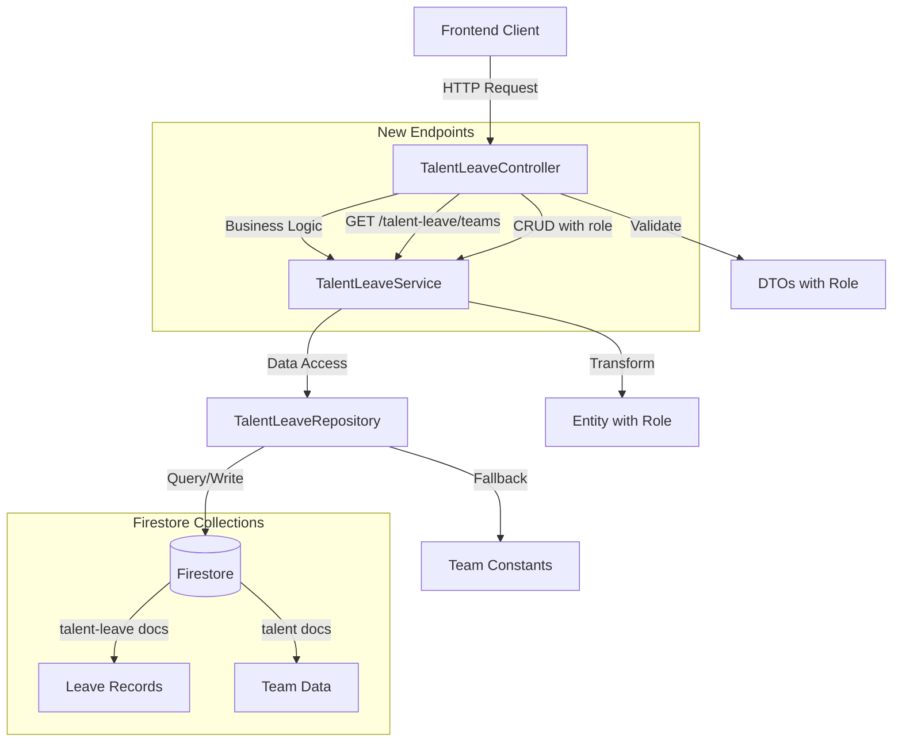

# Design Document: Talent Leave API Enhancements

## Overview

This design document outlines the implementation approach for two enhancements to the existing talent-leave API module:
1. **Adding a role field** to the talent-leave CRUD operations
2. **Creating a teams endpoint** to fetch unique team names from Firestore

The design follows NestJS best practices and maintains consistency with the existing talent-leave module architecture. All changes will be made within the existing `TalentLeaveModule` to keep related functionality together.

## Steering Document Alignment

### Technical Standards (tech.md)
- **Framework**: NestJS with TypeScript - follows existing backend stack
- **Testing**: Jest with unit and integration tests
- **Database**: Firebase Firestore using Admin SDK
- **API Architecture**: RESTful services following existing controller patterns
- **Configuration**: Environment-based configuration with @nestjs/config

### Project Structure (structure.md)
- **Module Organization**: All changes within `apps/aioc-service/src/modules/talent-leave/`
- **NestJS Conventions**: Controller → Service → Repository pattern
- **File Naming**: kebab-case for files (talent-leave.dto.ts)
- **Testing**: `.spec.ts` files alongside source files
- **DTOs**: Data Transfer Objects for validation and type safety

## Architecture



## Components and Interfaces

### 1. DTOs (interfaces/talent-leave.dto.ts)

**Purpose:** Define request/response data structures with role field

**Changes:**
```typescript
// ADD role field to CreateTalentLeaveDto
export interface CreateTalentLeaveDto {
  name: string;
  team: string;
  dateFrom: string;
  dateTo: string;
  status: string;
  role: string; // NEW FIELD
}

// ADD role field to UpdateTalentLeaveDto
export interface UpdateTalentLeaveDto {
  name?: string;
  team?: string;
  dateFrom?: string;
  dateTo?: string;
  status?: string;
  role?: string; // NEW FIELD
}

// ADD role field to TalentLeaveResponseDto
export interface TalentLeaveResponseDto {
  id: string;
  name: string;
  team: string;
  dateFrom: string;
  dateTo: string;
  status: string;
  role: string; // NEW FIELD
  createdAt: string;
  updatedAt: string;
}
```

**Dependencies:** None (interface definitions)

### 2. Entity (interfaces/talent-leave.entity.ts)

**Purpose:** Internal database entity structure

**Changes:**
```typescript
export interface TalentLeaveEntity {
  id?: string;
  name: string;
  team: string;
  dateFrom: Date;
  dateTo: Date;
  status: string;
  role: string; // NEW FIELD
  createdAt: Date;
  updatedAt: Date;
}
```

**Dependencies:** None (interface definition)

### 3. Repository (repositories/talent-leave.repository.ts)

**Purpose:** Data access layer for Firestore operations

**New Method:**
```typescript
async findAllTeams(): Promise<string[]> {
  // Query 'talent' collection
  // Extract unique team names
  // Handle string and array team fields
  // Return unique team list
}
```

**Updated Methods:**
- `create()`: Include role field in Firestore document
- `findAll()`: Map role field from Firestore, default to empty string if missing
- `findById()`: Map role field from Firestore, default to empty string if missing
- `update()`: Include role field in update payload if provided

**Interfaces:**
- `async create(data: TalentLeaveEntity): Promise<TalentLeaveEntity>`
- `async findAll(filters?: LeaveFilterDto): Promise<TalentLeaveEntity[]>`
- `async findById(id: string): Promise<TalentLeaveEntity | null>`
- `async update(id: string, data: Partial<TalentLeaveEntity>): Promise<TalentLeaveEntity | null>`
- `async delete(id: string): Promise<void>`
- `async findAllTeams(): Promise<string[]>` ← NEW

**Dependencies:**
- Firebase Admin SDK
- TalentLeaveEntity
- LeaveFilterDto

### 4. Service (talent-leave.service.ts)

**Purpose:** Business logic layer

**New Method:**
```typescript
async findAllTeams(): Promise<string[]> {
  // Call repository.findAllTeams()
  // If empty, return fallback hardcoded teams
  // Handle errors gracefully
}
```

**Updated Methods:**
- `create()`: Ensure role field is included in entity
- `update()`: Include role field in update data if provided
- `entityToDto()`: Map role field, default to empty string if undefined

**Interfaces:**
- `async create(dto: CreateTalentLeaveDto): Promise<TalentLeaveResponseDto>`
- `async findAll(filters?: LeaveFilterDto): Promise<TalentLeaveResponseDto[]>`
- `async findOne(id: string): Promise<TalentLeaveResponseDto>`
- `async update(id: string, dto: UpdateTalentLeaveDto): Promise<TalentLeaveResponseDto>`
- `async remove(id: string): Promise<void>`
- `isValidTimestamp(timestamp: string): boolean`
- `validateDateRange(dateFrom: string, dateTo: string): boolean`
- `async findAllTeams(): Promise<string[]>` ← NEW

**Dependencies:**
- TalentLeaveRepository
- DTOs

### 5. Controller (talent-leave.controller.ts)

**Purpose:** HTTP request handling and validation

**New Endpoint:**
```typescript
@Get('teams')
async getTeams(): Promise<string[]> {
  return this.service.findAllTeams();
}
```

**Updated Endpoints:**
- `POST /talent-leave`: Add role validation (required, non-empty)
- `PUT /talent-leave/:id`: Add role validation (if provided, must be non-empty)
- `GET /talent-leave`: No changes (returns role in response)
- `GET /talent-leave/:id`: No changes (returns role in response)
- `DELETE /talent-leave/:id`: No changes

**Route Order (CRITICAL):**
```typescript
@Controller('talent-leave')
export class TalentLeaveController {
  // 1. SPECIFIC ROUTES FIRST
  @Get('teams')  // Must come before :id
  async getTeams() { ... }

  @Post()
  async create() { ... }

  // 2. CATCH-ALL ROUTES
  @Get()
  async findAll() { ... }

  // 3. PARAMETERIZED ROUTES LAST
  @Get(':id')  // Must come after 'teams'
  async findOne() { ... }

  @Put(':id')
  async update() { ... }

  @Delete(':id')
  async remove() { ... }
}
```

**Dependencies:**
- TalentLeaveService
- DTOs
- NestJS decorators

## Data Models

### TalentLeaveEntity (Updated)
```typescript
{
  id?: string;              // Firestore document ID
  name: string;             // Team member name
  team: string;             // Team identifier (e.g., "SLS", "DS")
  dateFrom: Date;           // Leave start date
  dateTo: Date;             // Leave end date
  status: string;           // e.g., "approved", "pending", "cancelled"
  role: string;             // NEW: Team member role (e.g., "BE", "QA", "Mobile")
  createdAt: Date;          // Creation timestamp
  updatedAt: Date;          // Last update timestamp
}
```

### TalentDocument (Expected in Firestore)
```typescript
// Collection: 'talent'
{
  name?: string;
  team: string | string[];  // Can be single string or array
  role?: string;
  // ... other fields
}
```

### Team Response
```json
["SLS", "DS", "Product", "Leaders"]
```

## Implementation Details

### 1. Role Field Implementation

#### Phase 1: Update DTOs and Entity
- Add `role: string` to CreateTalentLeaveDto (required)
- Add `role?: string` to UpdateTalentLeaveDto (optional)
- Add `role: string` to TalentLeaveResponseDto (required)
- Add `role: string` to TalentLeaveEntity (required)

#### Phase 2: Update Repository
- Modify `create()` to persist role field
- Modify `findAll()`, `findById()` to map role field with fallback to empty string
- Modify `update()` to include role field if provided

#### Phase 3: Update Service
- Modify `create()` to include role in entity construction
- Modify `update()` to include role if provided
- Modify `entityToDto()` to map role field with fallback: `role: entity.role || ''`

#### Phase 4: Update Controller
- Add validation in `create()` endpoint:
  ```typescript
  if (!dto.role || dto.role.trim() === '') {
    throw new BadRequestException('role is required');
  }
  ```
- Add validation in `update()` endpoint:
  ```typescript
  if (dto.role !== undefined && dto.role.trim() === '') {
    throw new BadRequestException('role cannot be empty');
  }
  ```

### 2. Teams Endpoint Implementation

#### Phase 1: Repository Method
```typescript
async findAllTeams(): Promise<string[]> {
  try {
    const snapshot = await this.firestore.collection('talent').get();

    if (snapshot.empty) {
      return [];
    }

    const teamSet = new Set<string>();

    snapshot.docs.forEach(doc => {
      const data = doc.data();
      const team = data.team;

      if (typeof team === 'string' && team.trim() !== '') {
        teamSet.add(team.trim());
      } else if (Array.isArray(team)) {
        team.forEach(t => {
          if (typeof t === 'string' && t.trim() !== '') {
            teamSet.add(t.trim());
          }
        });
      }
    });

    return Array.from(teamSet).sort();
  } catch (error) {
    console.error('Failed to fetch teams from Firestore:', error);
    throw new InternalServerErrorException('Failed to fetch teams');
  }
}
```

#### Phase 2: Service Method with Fallback
```typescript
async findAllTeams(): Promise<string[]> {
  try {
    const teams = await this.repository.findAllTeams();

    // If no teams found, return hardcoded fallback
    if (teams.length === 0) {
      return [TEAM_LENDING, TEAM_FUNDING]; // ['SLS', 'DS']
    }

    return teams;
  } catch (error) {
    console.error('Service error fetching teams:', error);
    // Return fallback on error
    return [TEAM_LENDING, TEAM_FUNDING];
  }
}
```

#### Phase 3: Controller Endpoint
```typescript
@Get('teams')
@HttpCode(HttpStatus.OK)
async getTeams(): Promise<string[]> {
  return this.service.findAllTeams();
}
```

## Error Handling

### Error Scenarios

1. **Missing Role Field on Create**
   - **Handling:** Controller validation throws BadRequestException
   - **HTTP Status:** 400 Bad Request
   - **Response:** `{ "statusCode": 400, "message": "role is required" }`
   - **User Impact:** Clear error message indicating missing field

2. **Empty Role Field on Create/Update**
   - **Handling:** Controller validation throws BadRequestException
   - **HTTP Status:** 400 Bad Request
   - **Response:** `{ "statusCode": 400, "message": "role is required" }` or `"role cannot be empty"`
   - **User Impact:** Clear validation error

3. **Legacy Data Without Role Field**
   - **Handling:** Service layer defaults to empty string in `entityToDto()`
   - **HTTP Status:** 200 OK
   - **Response:** Role field returned as empty string `""`
   - **User Impact:** No error, backward compatible

4. **Firestore 'talent' Collection Missing**
   - **Handling:** Repository returns empty array, service returns fallback teams
   - **HTTP Status:** 200 OK
   - **Response:** Hardcoded teams `["SLS", "DS"]`
   - **User Impact:** API still works with default data

5. **Firestore Query Error**
   - **Handling:** Repository throws error, service catches and returns fallback
   - **HTTP Status:** 200 OK
   - **Response:** Hardcoded teams `["SLS", "DS"]`
   - **User Impact:** API continues to work with fallback data

6. **Invalid Date Formats (Existing)**
   - **Handling:** Controller validation throws BadRequestException
   - **HTTP Status:** 400 Bad Request
   - **Response:** `{ "statusCode": 400, "message": "dateFrom must be a valid ISO 8601 timestamp" }`
   - **User Impact:** Clear validation error

## Testing Strategy

### Unit Testing

#### Controller Tests (talent-leave.controller.spec.ts)
```typescript
describe('TalentLeaveController', () => {
  // Existing tests...

  // NEW: Role field validation tests
  describe('POST /talent-leave with role', () => {
    it('should reject request without role field', async () => {
      // Test missing role
    });

    it('should reject request with empty role', async () => {
      // Test empty string role
    });

    it('should accept request with valid role', async () => {
      // Test valid role
    });
  });

  describe('PUT /talent-leave/:id with role', () => {
    it('should reject update with empty role if provided', async () => {
      // Test empty role on update
    });

    it('should accept update with valid role', async () => {
      // Test role update
    });

    it('should accept update without role field', async () => {
      // Test partial update without role
    });
  });

  // NEW: Teams endpoint tests
  describe('GET /talent-leave/teams', () => {
    it('should return array of team names', async () => {
      // Mock service to return teams
      // Verify response format
    });

    it('should return fallback teams on service error', async () => {
      // Mock service to throw error
      // Verify fallback response
    });
  });
});
```

#### Service Tests (talent-leave.service.spec.ts)
```typescript
describe('TalentLeaveService', () => {
  // Existing tests...

  // NEW: Role field tests
  describe('create with role', () => {
    it('should include role in created entity', async () => {
      // Test role field persistence
    });
  });

  describe('update with role', () => {
    it('should update role field', async () => {
      // Test role field update
    });
  });

  describe('entityToDto with role', () => {
    it('should map role field to DTO', async () => {
      // Test role mapping
    });

    it('should default to empty string if role missing', async () => {
      // Test backward compatibility
    });
  });

  // NEW: Teams service tests
  describe('findAllTeams', () => {
    it('should return teams from repository', async () => {
      // Mock repository.findAllTeams()
      // Verify teams returned
    });

    it('should return fallback teams if repository returns empty', async () => {
      // Mock empty array from repository
      // Verify hardcoded teams returned
    });

    it('should return fallback teams on error', async () => {
      // Mock repository error
      // Verify fallback teams returned
    });
  });
});
```

#### Repository Tests (talent-leave.repository.spec.ts)
```typescript
describe('TalentLeaveRepository', () => {
  // Existing tests...

  // NEW: Role field tests
  describe('create with role', () => {
    it('should persist role field to Firestore', async () => {
      // Test Firestore write includes role
    });
  });

  describe('findAll with role', () => {
    it('should map role field from Firestore', async () => {
      // Test role mapping from documents
    });

    it('should default role to empty string if missing', async () => {
      // Test legacy document handling
    });
  });

  // NEW: Teams repository tests
  describe('findAllTeams', () => {
    it('should return unique team names from talent collection', async () => {
      // Mock Firestore snapshot with team data
      // Verify unique teams returned
    });

    it('should handle string team fields', async () => {
      // Mock documents with string team field
      // Verify teams extracted
    });

    it('should handle array team fields', async () => {
      // Mock documents with array team field
      // Verify all teams extracted
    });

    it('should skip documents without team field', async () => {
      // Mock mixed documents
      // Verify only valid teams returned
    });

    it('should return empty array if collection empty', async () => {
      // Mock empty snapshot
      // Verify empty array returned
    });

    it('should throw error on Firestore failure', async () => {
      // Mock Firestore error
      // Verify error thrown
    });
  });
});
```

### Integration Testing

#### E2E Tests
```typescript
describe('Talent Leave API (e2e)', () => {
  // Existing tests...

  // NEW: Role field integration tests
  describe('POST /talent-leave with role', () => {
    it('should create leave record with role', () => {
      return request(app.getHttpServer())
        .post('/talent-leave')
        .send({
          name: 'John Doe',
          team: 'SLS',
          dateFrom: '2025-01-01T00:00:00Z',
          dateTo: '2025-01-05T00:00:00Z',
          status: 'approved',
          role: 'Backend Engineer'
        })
        .expect(201)
        .expect(res => {
          expect(res.body.role).toBe('Backend Engineer');
        });
    });
  });

  describe('GET /talent-leave with role', () => {
    it('should return role field in all records', () => {
      return request(app.getHttpServer())
        .get('/talent-leave')
        .expect(200)
        .expect(res => {
          expect(res.body).toBeInstanceOf(Array);
          res.body.forEach(record => {
            expect(record).toHaveProperty('role');
            expect(typeof record.role).toBe('string');
          });
        });
    });
  });

  // NEW: Teams endpoint integration tests
  describe('GET /talent-leave/teams', () => {
    it('should return array of team names', () => {
      return request(app.getHttpServer())
        .get('/talent-leave/teams')
        .expect(200)
        .expect(res => {
          expect(res.body).toBeInstanceOf(Array);
          expect(res.body.length).toBeGreaterThan(0);
          res.body.forEach(team => {
            expect(typeof team).toBe('string');
          });
        });
    });

    it('should return unique team names', () => {
      return request(app.getHttpServer())
        .get('/talent-leave/teams')
        .expect(200)
        .expect(res => {
          const teams = res.body;
          const uniqueTeams = [...new Set(teams)];
          expect(teams).toEqual(uniqueTeams);
        });
    });
  });
});
```

## Migration Considerations

### Backward Compatibility
- Existing leave records without `role` field will continue to work
- Repository layer will default missing `role` to empty string
- No database migration required
- Gradual rollout: new records will have role, old records will show empty role

### Future Enhancements
- Consider adding role validation (enum of valid roles)
- Consider indexing role field for filtering
- Consider adding role to filter options in GET /talent-leave
- Consider API versioning if breaking changes needed

## API Documentation

### New/Updated Endpoints

#### GET /talent-leave/teams
**Description:** Fetch list of unique team names

**Authentication:** Required (Firebase JWT)

**Request:** None

**Response:** 200 OK
```json
["SLS", "DS", "Product", "Leaders"]
```

**Error Responses:**
- 500 Internal Server Error (if critical failure and no fallback available)

#### POST /talent-leave (Updated)
**Description:** Create new leave record with role

**Authentication:** Required (Firebase JWT)

**Request Body:**
```json
{
  "name": "John Doe",
  "team": "SLS",
  "dateFrom": "2025-01-01T00:00:00Z",
  "dateTo": "2025-01-05T00:00:00Z",
  "status": "approved",
  "role": "Backend Engineer"
}
```

**Response:** 201 Created
```json
{
  "id": "abc123",
  "name": "John Doe",
  "team": "SLS",
  "dateFrom": "2025-01-01T00:00:00Z",
  "dateTo": "2025-01-05T00:00:00Z",
  "status": "approved",
  "role": "Backend Engineer",
  "createdAt": "2025-01-01T10:00:00Z",
  "updatedAt": "2025-01-01T10:00:00Z"
}
```

**Error Responses:**
- 400 Bad Request: Missing or invalid role field
- 401 Unauthorized: Invalid authentication

#### GET /talent-leave (Updated Response)
**Response:** Now includes `role` field in each record

#### PUT /talent-leave/:id (Updated)
**Request Body:** Can now include optional `role` field for updates
