# Design Document - Update Jira Integration

## Overview
This design document outlines the technical approach for migrating the Jira integration from the deprecated `/rest/api/3/search` endpoint to the new `GET /rest/api/3/search/jql` endpoint. This migration involves significant breaking changes, particularly a complete rewrite of the pagination system from offset-based to token-based pagination.

**Key Challenge:** The new API fundamentally changes how pagination works, requiring updates to interfaces, request logic, and response processing while maintaining all existing functionality.

## Steering Document Alignment

### Technical Standards (tech.md)
- **NestJS Framework**: Maintain existing service/repository pattern with dependency injection
- **TypeScript**: Enforce strict typing throughout the integration with updated interfaces
- **Environment Configuration**: Use @nestjs/config for credentials and endpoint configuration
- **Testing Strategy**: Jest unit tests alongside source files (.spec.ts)
- **Error Handling**: Follow NestJS exception patterns with proper logging

### Project Structure (structure.md)
- **Module Organization**: Keep changes within `src/modules/reports/` following NestJS conventions
- **File Naming**: Use kebab-case for files, PascalCase for classes
- **Import Organization**: External libraries → Internal modules → Relative imports
- **Separation of Concerns**: Repository for data access, Service for business logic
- **Interface Location**: DTOs and entities in `interfaces/` subdirectory

### Product Vision (product.md)
- **Mission Critical**: Jira integration is core to team reporting platform functionality
- **Zero Downtime**: Migration must not disrupt team managers' sprint reporting workflow  
- **Performance**: Maintain or improve data collection speed for better user experience
- **Data Integrity**: Preserve all existing metrics (story points, complexity, productivity rates)

## Code Reuse Analysis

### Existing Patterns to Leverage
✅ **NestJS Module Structure**: `ReportsModule` with controller, service, and repository
✅ **Repository Pattern**: `ReportJiraRepository` for clean data access separation
✅ **TypeScript Interfaces**: Well-defined DTOs and entities for type safety
✅ **Environment Configuration**: Using process.env with proper defaults
✅ **Authentication**: Basic auth with username/API token approach
✅ **Business Logic**: All data processing, metrics calculation, and team member mapping
✅ **Custom Field Processing**: Existing extraction of customfields (story points, complexity)
✅ **Rate Limiting**: 1-second delays with timeout handling

### Components Requiring Updates
🔄 **Response Interfaces**: `JiraSearchResponseDto` needs token-based pagination fields
🔄 **Repository Methods**: `fetchRawData()` pagination logic complete rewrite
🔄 **Request Parameters**: Add nextPageToken, remove startAt
⚠️ **Error Handling**: Enhanced patterns for new API response format

### Code That Remains Unchanged
✅ **Service Business Logic**: `ReportsService.generateReport()` and processing methods
✅ **Controller Interface**: Public API contracts remain identical
✅ **Custom Field Extraction**: All `customfield_*` processing logic
✅ **Team Member Logic**: Existing team mapping and metrics calculation
✅ **Authentication Flow**: Username + API token Basic auth
✅ **Issue Transformation**: `transformIssues()` method works with same issue structure

## Architecture

The migration follows a **minimally invasive approach**, updating only the data access layer while preserving all business logic and public interfaces.

```mermaid
graph TB
    subgraph "External"
        JiraAPI[Jira Cloud API<br/>GET /rest/api/3/search/jql]
    end
    
    subgraph "AIoC Service"
        Controller[ReportsController<br/>📝 No changes needed]
        Service[ReportsService<br/>📝 No changes needed]
        Repository[ReportJiraRepository<br/>🔄 Pagination logic update]
        
        subgraph "Interfaces"
            RequestDTO[JiraSearchRequestDto<br/>📝 No changes needed]
            ResponseDTO[JiraSearchResponseDto<br/>🔄 Token pagination fields]
            IssueEntity[JiraIssueEntity<br/>📝 No changes needed]
        end
    end
    
    subgraph "Configuration"
        EnvVars[Environment Variables<br/>🔄 Add endpoint config]
        Config[ConfigModule<br/>📝 Existing pattern]
    end
    
    Controller --> Service
    Service --> Repository
    Repository --> JiraAPI
    Repository --> ResponseDTO
    Repository --> RequestDTO
    Repository --> IssueEntity
    
    Repository --> EnvVars
    EnvVars --> Config
    
    classDef unchanged fill:#90EE90
    classDef changed fill:#FFE4B5
    classDef critical fill:#FFB6C1
    
    class Controller,Service,RequestDTO,IssueEntity,Config unchanged
    class Repository,ResponseDTO,EnvVars changed
    class JiraAPI critical
```



### Key Architectural Decisions

1. **Repository-Only Changes**: Isolate all breaking changes to the repository layer
2. **Interface Evolution**: Update DTOs to match new API while maintaining backward compatibility
3. **Configuration Enhancement**: Make endpoints configurable for future API changes
4. **Error Handling Upgrade**: Implement retry logic and better error classification
5. **Type Safety**: Ensure all TypeScript interfaces match actual API responses

## Components and Interfaces

### 1. ReportJiraRepository (Updated)
**Purpose:** Handle all Jira API communication with new pagination system
**Location:** `src/modules/reports/repositories/report.jira.repository.ts`

**Current Interface:**
```typescript
async fetchRawData(dto: JiraSearchRequestDto): Promise<JiraIssueEntity[]>
```

**Updated Implementation:**
```typescript
class ReportJiraRepository {
  private readonly baseUrl: string;
  private readonly auth: { username: string; password: string };
  private readonly defaultMaxResults = 100;
  
  async fetchRawData(dto: JiraSearchRequestDto): Promise<JiraIssueEntity[]> {
    // New token-based pagination logic
    const allIssues: JiraIssueEntity[] = [];
    let nextPageToken: string | undefined = undefined;
    let isLast = false;
    
    do {
      const response = await this.makeRequest(dto, nextPageToken);
      allIssues.push(...this.transformIssues(response.issues));
      
      isLast = response.isLast;
      nextPageToken = response.nextPageToken;
      
      // Rate limiting
      if (!isLast) await this.rateLimitDelay();
    } while (!isLast);
    
    return allIssues;
  }
  
  private async makeRequest(
    dto: JiraSearchRequestDto, 
    nextPageToken?: string
  ): Promise<JiraSearchResponseDto> {
    // Implementation with new endpoint and parameters
  }
}
```

**Dependencies:** axios, @nestjs/config
**Reuses:** Existing auth, rate limiting, error handling patterns

### 2. JiraSearchResponseDto (Updated)
**Purpose:** Type-safe interface matching new API response format
**Location:** `src/modules/reports/interfaces/report.dto.ts`

**Current Interface:**
```typescript
interface JiraSearchResponseDto {
  expand: string;
  startAt: number;      // ❌ Remove
  maxResults: number;   // ❌ Remove  
  total: number;        // ❌ Remove
  issues: JiraIssueDto[];
}
```

**Updated Interface:**
```typescript
interface JiraSearchResponseDto {
  expand?: string;
  isLast: boolean;           // ✅ Add
  nextPageToken?: string;    // ✅ Add
  issues: JiraIssueDto[];
}

// Backward compatibility during migration
interface LegacyJiraSearchResponseDto {
  expand: string;
  startAt: number;
  maxResults: number;
  total: number;
  issues: JiraIssueDto[];
}
```

### 3. Enhanced Error Handling Service (New)
**Purpose:** Centralized error handling with retry logic and detailed logging
**Location:** `src/modules/reports/services/jira-error.service.ts`

```typescript
@Injectable()
export class JiraErrorService {
  private readonly logger = new Logger(JiraErrorService.name);
  
  async executeWithRetry<T>(
    operation: () => Promise<T>,
    context: string
  ): Promise<T> {
    // Exponential backoff retry logic
    // Rate limiting detection and handling
    // Detailed error logging
  }
  
  handleJiraApiError(error: any, context: string): never {
    // Classify error types (auth, rate limit, network, etc.)
    // Log appropriate details
    // Throw typed exceptions
  }
}
```

### 4. Configuration Service (Enhanced)
**Purpose:** Flexible configuration for endpoints and rate limiting
**Location:** Environment variables + ConfigModule

```typescript
interface JiraConfig {
  baseUrl: string;
  username: string;
  apiToken: string;
  searchEndpoint: string;      // ✅ Configurable endpoint path
  maxResults: number;          // ✅ Configurable page size  
  rateLimitDelay: number;      // ✅ Configurable rate limiting
  requestTimeout: number;      // ✅ Configurable timeouts
  retryAttempts: number;       // ✅ Configurable retry logic
}
```

**Environment Variables:**
```bash
JIRA_URL=https://your-domain.atlassian.net
JIRA_USERNAME=your-email@domain.com
JIRA_API_TOKEN=your-api-token
JIRA_SEARCH_ENDPOINT=/rest/api/3/search/jql  # ✅ New configurable
JIRA_MAX_RESULTS=100                         # ✅ New configurable
JIRA_RATE_LIMIT_MS=1000                     # ✅ New configurable
JIRA_REQUEST_TIMEOUT=30000                  # ✅ New configurable
JIRA_RETRY_ATTEMPTS=3                       # ✅ New configurable
```

## Data Models

### Request Parameters (Updated)
```typescript
interface JiraSearchRequestDto {
  sprint: string;
  assignees: string[];
  project: string;
}

interface JiraApiRequestParams {
  jql: string;
  nextPageToken?: string;    // ✅ New token-based pagination
  maxResults: number;
  fields: string;
  validateQuery: 'strict';
  expand?: string;           // ✅ Optional parameter support
  reconcileIssues?: number[]; // ✅ Optional parameter support
}
```

### Response Models (Updated)
```typescript
interface JiraSearchResponseDto {
  isLast: boolean;           // ✅ Pagination end indicator
  nextPageToken?: string;    // ✅ Next page token
  issues: JiraIssueDto[];
}

interface JiraIssueDto {
  expand: string;
  id: string;
  self: string;
  key: string;
  fields: JiraFieldEntity;   // ✅ Unchanged - all custom field logic preserved
}

interface JiraFieldEntity {
  summary: string;
  customfield_10005: number;           // Story Points
  customfield_10865: JiraCustomFieldEntity; // Complexity  
  customfield_10796: JiraCustomFieldEntity; // Story point type
  customfield_11015: JiraCustomFieldEntity; // Weight of complexity
  assignee: JiraAssigneeEntity;
  issuetype: JiraIssueTypeEntity;
}
```

### Internal Processing Models (Unchanged)
All existing entity transformations and business logic models remain identical:
- `JiraIssueEntity`: Simplified representation for internal processing
- `JiraIssueReportResponseDto`: Team performance metrics
- `GetReportResponseDto`: Final aggregated report format

## Error Handling Strategy

### Error Classification System
```typescript
enum JiraErrorType {
  AUTHENTICATION = 'authentication',
  RATE_LIMIT = 'rate_limit', 
  NETWORK = 'network',
  VALIDATION = 'validation',
  API_CHANGE = 'api_change',
  TIMEOUT = 'timeout'
}

class JiraIntegrationError extends Error {
  constructor(
    public type: JiraErrorType,
    public originalError: any,
    public context: string
  ) {
    super(`Jira ${type} error in ${context}`);
  }
}
```

### Retry Strategy
```typescript
interface RetryConfig {
  maxAttempts: number;
  baseDelay: number;
  maxDelay: number;
  exponentialBackoff: boolean;
  retryableErrors: JiraErrorType[];
}

// Default configuration
const DEFAULT_RETRY_CONFIG: RetryConfig = {
  maxAttempts: 3,
  baseDelay: 1000,
  maxDelay: 10000,
  exponentialBackoff: true,
  retryableErrors: [
    JiraErrorType.NETWORK,
    JiraErrorType.TIMEOUT,
    JiraErrorType.RATE_LIMIT
  ]
};
```

### Error Response Patterns
```typescript
// Graceful degradation for partial data
interface PartialDataResponse<T> {
  data: T[];
  errors: JiraIntegrationError[];
  isComplete: boolean;
  totalAttempted: number;
  successfulRequests: number;
}
```

## Testing Strategy

### Unit Tests (Enhanced)
**Location:** Alongside source files (`.spec.ts` pattern)

```typescript
// report.jira.repository.spec.ts
describe('ReportJiraRepository', () => {
  describe('Token-based pagination', () => {
    it('should handle single page response', async () => {
      // Test isLast: true scenario
    });
    
    it('should paginate through multiple pages', async () => {
      // Test nextPageToken flow
    });
    
    it('should handle missing nextPageToken gracefully', async () => {
      // Test edge cases
    });
  });
  
  describe('Error handling', () => {
    it('should retry on rate limit errors', async () => {
      // Test exponential backoff
    });
    
    it('should fail fast on auth errors', async () => {
      // Test non-retryable errors
    });
  });
  
  describe('Backward compatibility', () => {
    it('should produce identical results to legacy implementation', async () => {
      // Test data consistency
    });
  });
});
```

### Integration Tests (New)
**Location:** `src/modules/reports/tests/integration/`

```typescript
// jira-api.integration.spec.ts
describe('Jira API Integration', () => {
  describe('Real API calls', () => {
    it('should successfully fetch data from new endpoint', async () => {
      // Test against real/sandbox API
    });
    
    it('should handle rate limiting in real conditions', async () => {
      // Test actual rate limits
    });
  });
});
```

### Mock Data (Updated)
```typescript
// test/fixtures/jira-responses.ts
export const mockTokenBasedResponse: JiraSearchResponseDto = {
  isLast: false,
  nextPageToken: 'eyJ0eXAiOiJKV1QiLCJhbGciOiJIUzI1NiJ9...',
  issues: [/* existing mock issues */]
};

export const mockFinalPageResponse: JiraSearchResponseDto = {
  isLast: true,
  issues: [/* final page issues */]
};
```

### Test Coverage Requirements
- **Unit Tests**: 95%+ coverage for all new/modified code
- **Integration Tests**: Cover happy path and error scenarios
- **E2E Tests**: Verify complete report generation workflow
- **Performance Tests**: Ensure migration doesn't degrade performance

## Migration Strategy

### Phase 1: Preparation (Development)
1. ✅ Update TypeScript interfaces
2. ✅ Add new configuration options
3. ✅ Implement enhanced error handling
4. ✅ Create comprehensive tests

### Phase 2: Implementation (Development)
1. ✅ Rewrite repository pagination logic
2. ✅ Update request/response handling
3. ✅ Integrate retry mechanisms
4. ✅ Validate against test data

### Phase 3: Testing (Staging)
1. ✅ Deploy to staging environment
2. ✅ Run integration tests against real API
3. ✅ Verify data consistency with legacy system
4. ✅ Performance testing and optimization

### Phase 4: Deployment (Production)
1. ✅ Zero-downtime deployment
2. ✅ Monitor API response times and error rates
3. ✅ Rollback capability if issues arise
4. ✅ Cleanup legacy code after verification

## Risk Mitigation

### High-Risk Areas
1. **Pagination Logic**: Complete rewrite with complex edge cases
2. **API Response Changes**: Potential undocumented field modifications  
3. **Rate Limiting**: New API may have different limits
4. **Data Consistency**: Ensuring identical results to legacy system

### Mitigation Strategies
1. **Comprehensive Testing**: Unit, integration, and E2E tests
2. **Gradual Rollout**: Feature flags for easy rollback
3. **Monitoring**: Detailed logging and alerting
4. **Data Validation**: Cross-verification with legacy responses during transition
5. **Configuration**: Environment-based settings for quick adjustments

## Success Criteria

### Functional Requirements
- ✅ All existing reports generate identical data
- ✅ Performance equal or better than current implementation  
- ✅ Zero breaking changes to public API contracts
- ✅ Enhanced error handling and resilience

### Technical Requirements
- ✅ TypeScript compilation without errors
- ✅ All tests passing (95%+ coverage)
- ✅ Follows existing NestJS patterns and conventions
- ✅ Proper logging and monitoring in place

### Business Requirements
- ✅ No disruption to team managers' workflow
- ✅ Improved system reliability and error recovery
- ✅ Future-proof architecture for additional API changes
- ✅ Maintainable and well-documented code